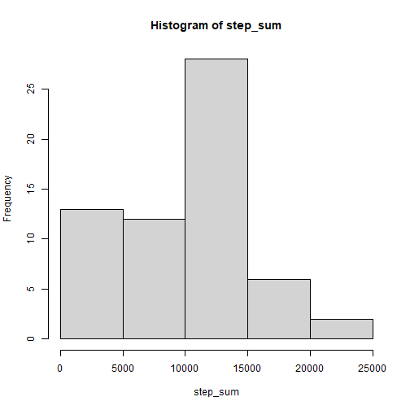
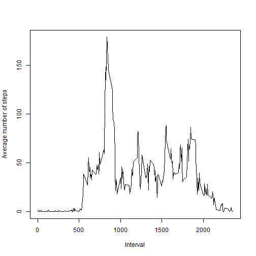
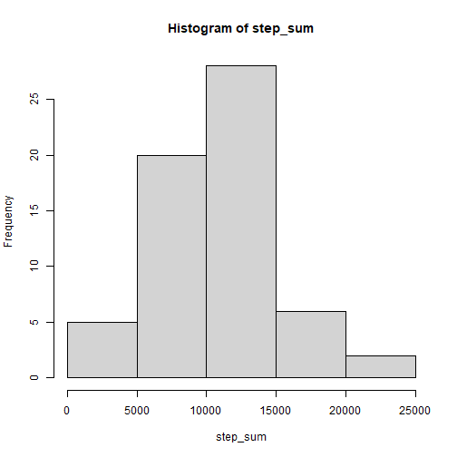
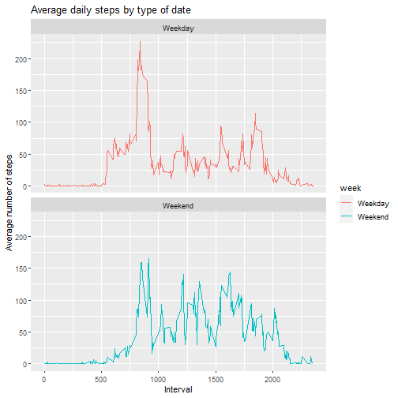

Loading the data

```r
datafile<-read.csv("activity.csv")
```
What is mean total number of steps taken per day?

```r
##Ignoring missing values and putting into a new variable
temp<-datafile
temp[is.na(datafile[,1]),1]<-0
library(ggplot2)
step_sum<-tapply(temp$steps,temp$date,sum)
##1. The total number of steps taken per day
print("Steps taken per day")
```

```
## [1] "Steps taken per day"
```

```r
print(step_sum)
```

```
## 2012-10-01 2012-10-02 2012-10-03 2012-10-04 2012-10-05 2012-10-06 
##          0        126      11352      12116      13294      15420 
## 2012-10-07 2012-10-08 2012-10-09 2012-10-10 2012-10-11 2012-10-12 
##      11015          0      12811       9900      10304      17382 
## 2012-10-13 2012-10-14 2012-10-15 2012-10-16 2012-10-17 2012-10-18 
##      12426      15098      10139      15084      13452      10056 
## 2012-10-19 2012-10-20 2012-10-21 2012-10-22 2012-10-23 2012-10-24 
##      11829      10395       8821      13460       8918       8355 
## 2012-10-25 2012-10-26 2012-10-27 2012-10-28 2012-10-29 2012-10-30 
##       2492       6778      10119      11458       5018       9819 
## 2012-10-31 2012-11-01 2012-11-02 2012-11-03 2012-11-04 2012-11-05 
##      15414          0      10600      10571          0      10439 
## 2012-11-06 2012-11-07 2012-11-08 2012-11-09 2012-11-10 2012-11-11 
##       8334      12883       3219          0          0      12608 
## 2012-11-12 2012-11-13 2012-11-14 2012-11-15 2012-11-16 2012-11-17 
##      10765       7336          0         41       5441      14339 
## 2012-11-18 2012-11-19 2012-11-20 2012-11-21 2012-11-22 2012-11-23 
##      15110       8841       4472      12787      20427      21194 
## 2012-11-24 2012-11-25 2012-11-26 2012-11-27 2012-11-28 2012-11-29 
##      14478      11834      11162      13646      10183       7047 
## 2012-11-30 
##          0
```

```r
##2. Histogram of number of steps
hist(step_sum)
```



```r
##3. Finding mean and median values
##Finding mean and median of steps taken per day
#This will return only the values
values<-as.numeric(step_sum)
print("Mean is:")
```

```
## [1] "Mean is:"
```

```r
print(mean(values))
```

```
## [1] 9354.23
```

```r
print("Median is:")
```

```
## [1] "Median is:"
```

```r
print(median(values))
```

```
## [1] 10395
```
What is the average daily activity pattern?

```r
##Ignoring removing NA and making it 0
interval_mean<-tapply(temp$steps,temp$interval,mean)
plot(interval_mean~names(interval_mean),type="l",xlab="Interval",ylab="Average number of steps")
```



```r
print("Maximum number of average steps in interval:")
```

```
## [1] "Maximum number of average steps in interval:"
```

```r
print(interval_mean)
```

```
##            0            5           10           15           20 
##   1.49180328   0.29508197   0.11475410   0.13114754   0.06557377 
##           25           30           35           40           45 
##   1.81967213   0.45901639   0.75409836   0.00000000   1.27868852 
##           50           55          100          105          110 
##   0.26229508   0.11475410   0.27868852   0.59016393   0.13114754 
##          115          120          125          130          135 
##   0.29508197   0.00000000   0.96721311   1.59016393   0.14754098 
##          140          145          150          155          200 
##   0.14754098   0.32786885   0.22950820   0.00000000   0.00000000 
##          205          210          215          220          225 
##   0.00000000   0.98360656   0.00000000   0.00000000   0.11475410 
##          230          235          240          245          250 
##   0.00000000   0.19672131   0.00000000   0.00000000   1.34426230 
##          255          300          305          310          315 
##   0.81967213   0.00000000   0.00000000   0.00000000   0.00000000 
##          320          325          330          335          340 
##   0.18032787   0.54098361   1.40983607   0.50819672   0.42622951 
##          345          350          355          400          405 
##   0.06557377   0.00000000   0.00000000   1.03278689   0.81967213 
##          410          415          420          425          430 
##   2.22950820   0.00000000   0.29508197   0.31147541   3.57377049 
##          435          440          445          450          455 
##   0.57377049   3.03278689   0.72131148   2.70491803   0.96721311 
##          500          505          510          515          520 
##   0.00000000   1.36065574   2.60655738   1.95081967   2.88524590 
##          525          530          535          540          545 
##   2.57377049   1.81967213   5.26229508  13.91803279  15.93442623 
##          550          555          600          605          610 
##  34.27868852  38.65573770  27.36065574  42.80327869  46.72131148 
##          615          620          625          630          635 
##  55.13114754  43.40983607  40.90163934  45.31147541  34.18032787 
##          640          645          650          655          700 
##  38.24590164  38.37704918  32.45901639  42.60655738  38.06557377 
##          705          710          715          720          725 
##  38.55737705  43.88524590  47.36065574  43.37704918  44.29508197 
##          730          735          740          745          750 
##  48.37704918  38.50819672  45.40983607  60.42622951  50.26229508 
##          755          800          805          810          815 
##  48.78688525  63.75409836  59.26229508 112.45901639 136.86885246 
##          820          825          830          835          840 
## 148.70491803 135.01639344 154.04918033 179.13114754 170.22950820 
##          845          850          855          900          905 
## 156.01639344 159.34426230 145.11475410 124.63934426 107.77049180 
##          910          915          920          925          930 
##  94.80327869  93.93442623  90.11475410  83.37704918  57.52459016 
##          935          940          945          950          955 
##  39.29508197  21.54098361  33.67213115  30.39344262  18.29508197 
##         1000         1005         1010         1015         1020 
##  35.24590164  23.44262295  36.85245902  45.75409836  33.81967213 
##         1025         1030         1035         1040         1045 
##  44.13114754  38.47540984  32.50819672  30.14754098  24.62295082 
##         1050         1055         1100         1105         1110 
##  21.80327869  27.75409836  27.24590164  25.78688525  18.52459016 
##         1115         1120         1125         1130         1135 
##  22.19672131  24.65573770  23.00000000  29.04918033  43.42622951 
##         1140         1145         1150         1155         1200 
##  36.52459016  38.75409836  40.00000000  51.42622951  55.49180328 
##         1205         1210         1215         1220         1225 
##  76.19672131  82.40983607  80.60655738  55.08196721  43.59016393 
##         1230         1235         1240         1245         1250 
##  47.32786885  28.16393443  23.04918033  32.78688525  39.14754098 
##         1255         1300         1305         1310         1315 
##  58.45901639  36.78688525  34.65573770  37.59016393  35.60655738 
##         1320         1325         1330         1335         1340 
##  40.18032787  49.03278689  37.14754098  21.83606557  34.72131148 
##         1345         1350         1355         1400         1405 
##  46.52459016  41.11475410  52.83606557  48.44262295  45.14754098 
##         1410         1415         1420         1425         1430 
##  37.86885246  42.31147541  30.81967213  32.62295082  36.36065574 
##         1435         1440         1445         1450         1455 
##  23.90163934  14.86885246  22.65573770  37.90163934  38.03278689 
##         1500         1505         1510         1515         1520 
##  26.08196721  31.34426230  30.83606557  33.75409836  39.93442623 
##         1525         1530         1535         1540         1545 
##  41.49180328  41.81967213  56.75409836  72.03278689  85.72131148 
##         1550         1555         1600         1605         1610 
##  88.72131148  72.95081967  53.98360656  55.72131148  64.77049180 
##         1615         1620         1625         1630         1635 
##  54.88524590  49.44262295  51.93442623  38.11475410  33.50819672 
##         1640         1645         1650         1655         1700 
##  38.80327869  39.49180328  40.14754098  37.95081967  40.50819672 
##         1705         1710         1715         1720         1725 
##  48.91803279  44.06557377  53.19672131  63.18032787  68.59016393 
##         1730         1735         1740         1745         1750 
##  59.90163934  51.83606557  65.24590164  49.09836066  30.21311475 
##         1755         1800         1805         1810         1815 
##  32.54098361  35.34426230  50.40983607  64.90163934  74.13114754 
##         1820         1825         1830         1835         1840 
##  51.49180328  58.88524590  67.50819672  64.50819672  74.14754098 
##         1845         1850         1855         1900         1905 
##  86.40983607  75.22950820  74.37704918  73.73770492  67.62295082 
##         1910         1915         1920         1925         1930 
##  50.42622951  46.36065574  31.55737705  18.00000000  23.80327869 
##         1935         1940         1945         1950         1955 
##  34.77049180  26.24590164  22.19672131  39.67213115  29.13114754 
##         2000         2005         2010         2015         2020 
##  17.04918033  16.52459016  16.80327869  28.96721311  23.29508197 
##         2025         2030         2035         2040         2045 
##  18.39344262  23.72131148  18.54098361  16.98360656  18.52459016 
##         2050         2055         2100         2105         2110 
##  28.06557377  17.50819672  13.85245902  14.96721311  20.37704918 
##         2115         2120         2125         2130         2135 
##  16.72131148  10.81967213   6.96721311  12.73770492  14.16393443 
##         2140         2145         2150         2155         2200 
##   7.54098361   6.77049180   7.06557377   2.27868852   1.26229508 
##         2205         2210         2215         2220         2225 
##   3.19672131   4.18032787   7.39344262   6.14754098   7.55737705 
##         2230         2235         2240         2245         2250 
##   8.47540984   1.91803279   0.27868852   0.09836066   1.39344262 
##         2255         2300         2305         2310         2315 
##   4.00000000   2.86885246   2.47540984   0.00000000   0.72131148 
##         2320         2325         2330         2335         2340 
##   0.83606557   1.37704918   2.26229508   4.08196721   2.86885246 
##         2345         2350         2355 
##   0.55737705   0.19672131   0.93442623
```

```r
mx<-max(interval_mean)
index<-which(mx==interval_mean)
print(names(interval_mean)[index[[1]]])
```

```
## [1] "835"
```
Imputing missing values

```r
#Calculate and report the total number of missing values in the dataset (i.e. the total number of rows with NA's)
nas<-sum(is.na(datafile$steps)|is.na(datafile$interval))
print("Number of rows with NA:")
```

```
## [1] "Number of rows with NA:"
```

```r
print(nas)
```

```
## [1] 2304
```

```r
#Devise a strategy for filling in all of the missing values in the dataset. The strategy does not need to be sophisticated. For example, you could use the mean/median for that day, or the mean for that 5-minute interval, etc.
##Finding mean of values in the same interval and using it to
##impute the NA's
new_datafile<-datafile
int_mean<-tapply(temp$steps,temp$interval,mean)
for(i in unique(datafile$interval)){
  new_datafile[is.na(new_datafile$steps)&(new_datafile$interval==i),"steps"]<-as.numeric(int_mean[names(int_mean)==i])
}
##Histogram, mean and median of new datafile
step_sum<-tapply(new_datafile$steps,new_datafile$date,sum)
hist(step_sum)
```



```r
print("Mean:")
```

```
## [1] "Mean:"
```

```r
values<-as.numeric(step_sum)
print(mean(values))
```

```
## [1] 10581.01
```

```r
print("Median:")
```

```
## [1] "Median:"
```

```r
print(median(values))
```

```
## [1] 10395
```
From the above we can see that mean has changed slightly and median has not. This implies that by using even a simple model for imputing like just converting NA's to respective means, we can solve the issue of missing values without impacting the calculations and analysis too much.

Are there differences in activity patterns between weekdays and weekends?

```r
library(dplyr)
##Converting date field to date class
new_datafile$date<-as.Date(as.character(new_datafile$date),"%Y-%m-%d")
new_datafile<-mutate(new_datafile,week=weekdays(date))
new_datafile$week<-sapply(new_datafile$week,                          function(x){if(x=="Saturday"|x=="Sunday"){y<-"Weekend"}
  else{y<-"Weekday"}
  y
  })
activity_by_date <- aggregate(steps~interval + week, new_datafile, mean, na.rm = TRUE)
plot<- ggplot(activity_by_date, aes(x = interval , y = steps, color = week)) +
       geom_line() +
       labs(title = "Average daily steps by type of date", x = "Interval", y = "Average number of steps") +
       facet_wrap(~week, ncol = 1, nrow=2)
print(plot)
```


